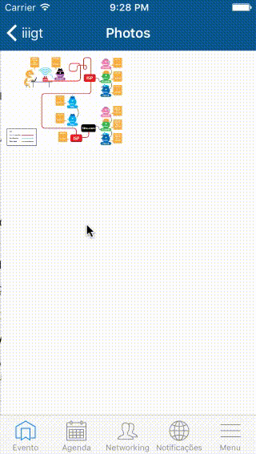

ETGalleryViewController
========
A simple photo gallery ready to be subclassed and personalized. **ETGalleryViewController** provides a UICollectionViewController with delegates wich will ask for your images sources urls and will load them dinamically (using [SDWebImage](https://github.com/rs/SDWebImage)) into the collectionView. A grid will be shown and images can be touched (using [JTSImageViewController](https://github.com/jaredsinclair/JTSImageViewController)).

Installation
--------
Clone this repo and copy the folder **ETGalleryViewController** into your Xcode project.

How-to
--------



### Initialization

Programmatically, you must create using a traditional bundle.

```
- (id)initWithNibName:(NSString *)nibNameOrNil bundle:(NSBundle *)nibBundleOrNil
```

### Delegate

You have several delegate callbacks available to you. Just hook your delegate outlet and you are ready to go!

```
@required
- (NSInteger)numberOfSectionsInGalleryController:(ETGalleryViewController *)galleryController;
- (NSInteger)galleryController:(ETGalleryViewController *)galleryController numberOfImagesAtSection:(NSInteger)section;
- (NSURL *)galleryController:(ETGalleryViewController *)galleryController urlForImageAtIndexPath:(NSIndexPath *)indexPath;
- (CGSize)galleryController:(ETGalleryViewController *)galleryController maximumSizeForImageAtIndexPath:(NSIndexPath *)indexPath;

@optional
- (void)galleryController:(ETGalleryViewController *)galleryController imageTappedAtIndexPath:(NSIndexPath *)indexPath;
```

### Localization

This component is currently translated to English, Portuguese and Spanish.

Support
--------
Just open an issue on Github and we'll get to it as soon as possible.

About
--------
**ETGalleryViewController** is brought to you by Trilha.
